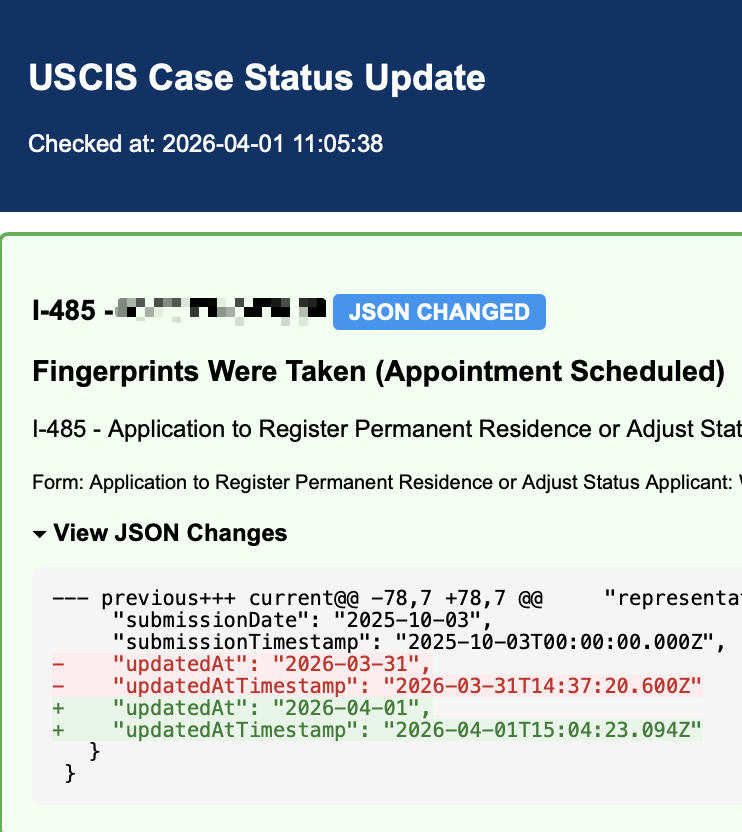

# USCIS API Case Tracker

Automatically monitors your USCIS case status by reading the JSON response from the official USCIS API, and sends you an email notification whenever the status changes. Supports multiple accounts simultaneously.

**Tested on:**
- ✅ Raspberry Pi (ARM64 / Debian)
- ✅ macOS
- ⚠️ Windows — should work in theory, but not tested. Reports welcome.

## How it works

1. A browser window (Chrome or Chromium) stays open and logged in to your USCIS account.
2. The tracker checks your case status every hour via the USCIS API.
3. When the status changes, you get an email with the new status and a link to your case.
4. If the session expires, the tracker automatically logs back in using your credentials and a Gmail 2FA code.

## Example notification



## Prerequisites

- Python 3.9 or higher
- Google Chrome or Chromium browser
- A Gmail account for receiving USCIS status notifications (can be the same account used for USCIS login)
- A Gmail **App Password** for 2FA code retrieval (not your regular Gmail password)
- **Your USCIS account's verification method must be set to "Email"** (not SMS) so the tracker can fetch 2FA codes automatically from Gmail. Change this at [myaccount.uscis.gov](https://myaccount.uscis.gov/) → Profile → Two-Step Verification → choose **Email**.

> **Raspberry Pi / ARM Linux users:** also install chromedriver via apt — Selenium can't auto-download an ARM build:
> ```bash
> sudo apt install chromium-chromedriver
> ```
> On x86 Linux, macOS, and Windows, Selenium auto-manages the driver.

### Getting a Gmail App Password

1. Enable 2-Step Verification on your Google account at [myaccount.google.com/security](https://myaccount.google.com/security)
2. Go to [myaccount.google.com/apppasswords](https://myaccount.google.com/apppasswords)
3. Create a new app password (name it anything, e.g. "USCIS Tracker")
4. Copy the 16-character password — you'll need it in the config

## Setup

### 1. Clone the repository

```bash
git clone https://github.com/wangchao92/uscis-api-case-tracker.git
cd uscis-api-case-tracker
```

### 2. Install dependencies

```bash
pip install -r requirements.txt
```

### 3. Configure

Copy the example config and fill in your details:

```bash
cp config.yaml.example config.yaml
```

Edit `config.yaml`:

```yaml
uscis:
  check_interval_hours: 1   # How often to check (hours)
  accounts:
    - name: "My Account"
      browser_port: 9222              # Leave as-is unless you have a conflict
      browser_profile_path: "./browser-profile-uscis1"  # Where to store browser data
      username: "you@gmail.com"       # Your USCIS login email
      password: "your_uscis_password"
      verification_email: "you@gmail.com"        # Gmail for fetching 2FA codes
      verification_app_password: "xxxx xxxx xxxx xxxx"  # Gmail App Password (16 chars)
      cases:
        - case_number: "IOE0000000000"   # Your USCIS case number
          case_type: "I-485"

email:
  smtp_server: "smtp.gmail.com"
  smtp_port: 587
  sender_email: "you@gmail.com"
  sender_password: "xxxx xxxx xxxx xxxx"   # Same Gmail App Password
  recipient_email: "you@gmail.com"         # Where to send notifications
```

> **Important:** Both the `accounts` block AND the `email` block must be filled in. The `email` block controls where status-change notifications are sent — leaving it empty or with placeholder values will cause an SMTP authentication error. The same Gmail App Password works for both `verification_app_password` (fetching 2FA codes via IMAP) and `sender_password` (sending notifications via SMTP).

**Security note:** `config.yaml` is excluded from git and will never be committed.

### 4. Start the browser

```bash
python start_browser.py
```

This opens a Chrome/Chromium window for each account. **Log in to your USCIS account** in each browser window. Once logged in, leave the windows open — the tracker will keep the sessions alive automatically.

### 5. Run the tracker

```bash
python tracker.py
```

The tracker will check your cases immediately, then every hour. Keep this terminal running (or set it up as a background service — see below).

## Running in the background (optional)

### Linux / Raspberry Pi

Use `nohup` to keep it running after you close the terminal:

```bash
nohup python tracker.py > tracker.log 2>&1 &
```

Or create a systemd service for automatic startup.

### macOS

```bash
nohup python tracker.py > tracker.log 2>&1 &
```

### Windows

Run in a minimized Command Prompt, or create a Task Scheduler entry.

## Tracking multiple accounts

Add additional entries under `accounts:` in `config.yaml`. Each account needs a unique `browser_port` (9222, 9223, etc.):

```yaml
accounts:
  - name: "My Account"
    browser_port: 9222
    ...
  - name: "Spouse Account"
    browser_port: 9223
    ...
```

`start_browser.py` will open one browser window per account automatically.

## Platform notes

| Platform | Browser command auto-detected | Tested |
|---|---|---|
| Raspberry Pi / Debian Linux | `chromium-browser` | ✅ Yes |
| Ubuntu / Other Linux | `chromium`, `google-chrome` | ⚠️ Should work |
| macOS | `/Applications/Google Chrome.app/...` or Chromium | ✅ Yes |
| Windows | Standard Chrome install path | ⚠️ Untested |

## Troubleshooting

**"Chromium remote debugging not available"**  
The browser isn't running or wasn't started with the right flags. Run `python start_browser.py` first.

**"IMAP auth error"**  
Your Gmail App Password is wrong or IMAP is disabled. Check [Gmail settings → Forwarding and POP/IMAP](https://mail.google.com/mail/u/0/#settings/fwdandpop) and make sure IMAP is enabled.

**"Login Failed" email notification**  
The auto-login couldn't complete. Open the browser window for that account, log in manually, then restart `tracker.py`.

**500 errors in the log**  
Usually means the session expired mid-check. The tracker will automatically retry with a fresh login on the next cycle.

## Disclaimer

This is an unofficial tool and is not affiliated with, endorsed by, or sponsored by USCIS or the U.S. government. It uses the same public API that the USCIS website itself calls. Use at your own risk — be respectful of the service (the default 1-hour check interval is intentionally conservative; don't lower it aggressively). The author assumes no responsibility for any consequences of use, including missed notifications or account issues.

## License

[MIT](LICENSE)
